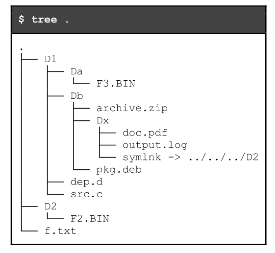
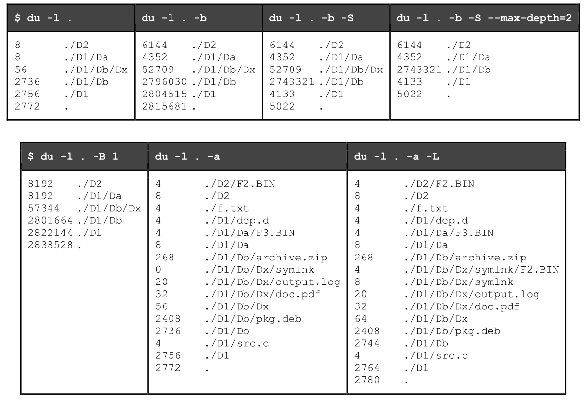
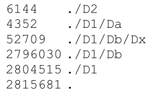

# SOPE PROJECT

- [SOPE PROJECT](#sope-project)
  - [Sumário](#sum%c3%a1rio)
    - [Comando `du`](#comando-du)
    - [Requisitos Funcionais](#requisitos-funcionais)
      - [`simpledu -l [path] [-a] [-b] [-B size] [-L] [-S] [--max-depth=N]`](#simpledu--l-path--a--b--b-size--l--s---max-depthn)
    - [Apresentação de resultados](#apresenta%c3%a7%c3%a3o-de-resultados)
    - [Registo/Logs](#registologs)
      - [`instant – pid – action – info`](#instant-%e2%80%93-pid-%e2%80%93-action-%e2%80%93-info)
    - [Interrupção pelo utilizador](#interrup%c3%a7%c3%a3o-pelo-utilizador)
    - [Requisitos Arquiteturais](#requisitos-arquiteturais)
  - [Plano de Trabalho](#plano-de-trabalho)
  - [Testar](#testar)
  - [Tarefas](#tarefas)

## Sumário

> Pretende-se desenvolver uma ferramenta para sumariar a utilização de espaço em disco de um ficheiro ou diretório. No caso de um diretório, a informação a disponibilizar deve contemplar ficheiros e subdiretórios que, eventualmente, nele estejam contidos.

A ferramenta a desenvolver ,`simpledu`, deve ter como referência o comando `du` - *estimate file space usage*, o qual apresenta informação sobre o espaço em disco utilizado por ficheiros e diretórios.

Deve tentar-se reproduzir a informação apresentada pelo comando `du` correntemente instalado. Por omissão, o comando `du`:
* apresenta o espaço ocupado em número de blocos de 1024 bytes;
* apenas lista diretórios;
* não segue links simbólicos,contabiliza uma única vez cada ficheiro;
* apresenta de forma cumulativa o tamanho de subdiretórios e ficheiros incluídos;
* não restringe os níveis de profundidade na estrutura de diretórios.

Esta forma de operação deve ser reproduzida pela ferramenta `simpledu`, mas considerando apenas um subconjunto das opções de invocação disponibilizadas pelo comando du:
* `-a , --all` – a informação exibida diz respeito também a ficheiros;
* `-b , --bytes` – apresenta o número real de bytes de dados (ficheiros) ou alocados (diretórios);
* `-B , --block-size=SIZE` – define o tamanho (bytes) do bloco para efeitos de representação;
* `-l , --count-links` – contabiliza múltiplas vezes o mesmo ficheiro;
* `-L , --dereference` – segue links simbólicos;
* `-S , --separate-dirs` – a informação exibida não inclui o tamanho dos subdiretórios;
* `--max-depth=N` – limita a informação exibida a N (0,1, ...) níveis de profundidade de diretórios.

Não se pretende que seja mantido um registo dos ficheiros ou diretórios já processados (por exemplo, para evitar a sua contabilização por múltiplas vezes ou para impedir a existência de ciclos através de links simbólicos), por isso, **deve ser assumido que a opção -l (ou --count-links) é sempre usada.**

> NOTAS: 

> * Cada processo deve analisar somente um diretório e é responsável por criar um processo por cada um dos subdiretórios que, eventualmente, nele possam estar contidos.

> * O tamanho dos blocos usados num dado disco, disponível no campo `st_blksize` da estrutura `stat (struct stat)`, pode ser também obtido usando o comando `$ stat -f fich_dir`

### Comando `du`




### Requisitos Funcionais

#### `simpledu -l [path] [-a] [-b] [-B size] [-L] [-S] [--max-depth=N]`

Apesar de ser referida apenas uma alternativa por opção de invocação, caso exista uma segunda, a implementação da ferramenta deve suportar ambas (por exemplo, `-a ou --all`). Por questões de simplicidade, não é requerido que múltiplas opções possam ser especificadas usando um único argumento (por exemplo, `-LabS`).

O processo-pai (primeiro a ser executado) deve sempre aguardar pela terminação de todos os processos-filho antes de terminar a sua execução (ver requisitos arquiteturais).

### Apresentação de resultados
Ter em atenção a existência de um caráter de tabulação entre o número de bytes ou blocos e o caminho para o ficheiro ou diretório.
Exemplo:


### Registo/Logs

Criar e Usar a variável de ambiente `LOG_FILENAME` para guardar o path do ficheiro de logs que será escrito por todos os processos.

Qualquer um dos processos participantes na operação do programa acede ao ficheiro, acrescentando-lhe informação, linha a linha, no seguinte formato:
#### `instant – pid – action – info`
* **instant** é o instante de tempo imediatamente anterior ao registo, medido em milissegundos e
com 2 casas decimais, tendo como referência o instante em que o programa começou a executar;
* **pid** é o identificador do processo que faz o registo da linha, com espaço fixo para 8 algarismos;
* **action** é a descrição do tipo de evento: `CREATE, EXIT, RECV_SIGNAL, SEND_SIGNAL, RECV_PIPE, SEND_PIPE e ENTRY;`
* info é a informação adicional para cada uma das ações:
  * **CREATE** – os argumentos da linha de comandos;
  * **EXIT** – o código de saída (exit status);
  * **RECV_SIGNAL** – o sinal recebido (por exemplo, SIGINT);
  * **SEND_SIGNAL** – o sinal enviado seguido do pid do processo a quem se destina;
  * **RECV_PIPE** – a mensagem enviada;
  * **SEND_PIPE** – a mensagem recebida;
  * **ENTRY** – número de bytes (ou blocos) seguido do caminho.

### Interrupção pelo utilizador

Estando a ferramenta simpledu em execução, quando for enviado o sinal **SIGINT (CTRL+C)**, todo o programa deve suspender a sua operação, incluindo todos processos associados, e ser apresentada uma mensagem de confirmação ao utilizador para a terminação do mesmo. Caso o utilizador confirme a intenção de terminar o programa, devem ser terminadas quaisquer operações que possam estar pendentes antes da saída; caso o utilizador pretenda continuar a execução do programa, as operações devem ser retomadas imediatamente.

> o processo-pai deve enviar um sinal **SIGSTOP** a todos os processos-filho que estiverem em execução quando receber um sinal **SIGINT**; o envio do sinal seguinte depende da confirmação (**SIGTERM**) ou não (**SIGCONT**) por parte do utilizador relativamente à terminação do programa.

### Requisitos Arquiteturais

* Cada um dos subdiretórios que, eventualmente, nele possam estar contidos; os argumentos que lhe são passados devem ser ajustados para que o caminho (`path`) e o nível máximo de profundidade (`--max-depth`) reflitam o pretendido;
* O processo-pai (primeiro a ser executado) deve sempre aguardar pela terminação de todos os processos-filho antes de terminar a sua execução;
* usar o mesmo código (sem alterações) independentemente de ser ou não o processo principal;
* o tamanho total de cada um dos subdiretórios deve ser comunicado ao processo-pai através de um pipe (sem nome) criado para cada um dos processos-filho;

## Plano de Trabalho
> Descrito nas especificações do Projeto

No sentido de tornar o desenvolvimento da ferramenta `simpledu` mais modular, é sugerido que o desenvolvimento seja feito de acordo com os seguintes passos:

1. Receber, processar e guardar os argumentos da linha de comandos e as variáveis de ambiente;
2. Adicionar as mensagens de registo à medida que forem implementadas novas funcionalidades e validar a correção de ambas;
3. Começar por escolher apenas ficheiros e apresentar a informação pretendida (bytes e blocos);
   1. Considerar que a opção `-L (ou --dereference)` está ativa para não ser necessário distinguir links simbólicos de ficheiros regulares.
4. Fazer a distinção entre ficheiros e links simbólicos e apresentar resultados distintos em função da opção `-L`;
5. Considerar entradas que sejam diretórios, mas limitar a análise a um nível `(--max-depth=1)`;
6. Criar um novo processo por subdiretório e tentar passar-lhe os argumentos corretos;
   1. Os argumentos serão os mesmos exceto o caminho `(path/entry)` e, eventualmente, o nível máximo de profundidade permitido `(--max-depth=N-1)`;
   2. Assumir que a opção `-S (ou --separate-dirs)` está ativa para que não seja necessário considerar cumulativamente o tamanho dos subdiretórios.
7. Criar pipes para comunicar o tamanho de um dado subdiretório ao processo-pai e assim apresentar corretamente resultados cumulativos, incluindo para subdiretórios.

## Testar

Considerando um teste T definido por um conjunto de argumentos `arg1, arg2, ..., argN`, o sucesso ou insucesso de um determinado teste será determinado pelo seguinte conjunto de comandos:

```bash
$ (./simpledu <arg1 args2 ... argN> || echo $?) | sort -k2 > testeT_simpledu.txt
$ (du <arg1 args2 ... argN> || echo $?) | sort -k2 > testeT_du.txt
$ diff -q testeT_simpledu.txt testeT_du.txt > /dev/null 2>&1 && echo OK || echo FAILED
```
>O resultado será OK ou FAILED.
>Os argumentos `arg1 args2 ... argN`, obviamente, devem ser substituídos pelos argumentos pretendidos (por exemplo, `../my_test_folder/ -l -S`).

## Tarefas 
> NOTA: As seguintes sugestões foram dadas por mim - Eduardo Brito - estando pendentes de revisão e modificação.
1. Criar um `Makefile` para o projeto e habilitar a sua utilização
2. Criar o ficheiro `proj.c`
    #### `simpledu -l [path] [-a] [-b] [-B size] [-L] [-S] [--max-depth=N]`
   1. Fazer Parse dos argumentos da linha de comandos e variávies de ambiente
   2. Com base nos respetivos argumentos, definir as tarefas a realizar
      1. Cada opção *ativa uma flag* numa *máscara* relacionada com as tarefas, e a função responsável por obter a informação dos ficheiros/diretórios recorre sempre a essa máscara para saber o que procurar e como procurar.
      Exemplo para a **máscara de bits**:

      | 1 | X | X | X | size | X | X | max-depth |
      |---|---|---|---|------|---|---|-----------|
      |-l |-a |-b |-B | int  |-L |-S | int       |

      > * X representa 1 ou 0 conforme a opção foi ativada ou não pelo utilizador
      > * max-depth diminui ao entrar em cada subdiretório
      > * existirá também uma variável para o path que muda ao entrar em cada subdiretório

    3. Começar a preparar uma função para registar os Logs de cada processo - `LOG_FILENAME` será a variável de ambiente que guardará o nome do ficheiro.
    4. Criar e registar um Handler para `SIGINT` que trata da ação do utilizador quando é recebido um `Ctrl-C`
    > o processo-pai deve enviar um sinal **SIGSTOP** a todos os processos-filho que estiverem em execução quando receber um sinal **SIGINT**; o envio do sinal seguinte depende da confirmação (**SIGTERM**) ou não (**SIGCONT**) por parte do utilizador relativamente à terminação do programa.
    5. Na pasta *test* da raíz deste repositório, criar um/vários diretório(s) com ficheiros e subdiretórios aleatórios, para ser possível testar os resultados.
    6. Acrescentar ou modificar estas tarefas/sugestões